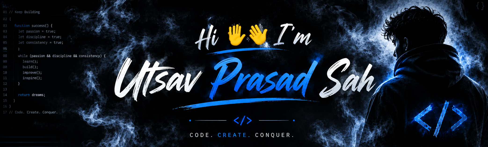

<!-- apply a github profile readme generator -->

<h3 align="center">Frontend Developer passionate about clean UI and seamless UX
</h3>

  

<ul dir="auto" align="left">
    <li>
🔭 I’m currently working on <a href="https://tekgro.com.au/" rel="nofollow">Tekgro Nepal Pvt. Ltd</li>
    <li>
💬 Ask me about <strong>react js, Nest.js javascript, tailwind, php, mysql</strong>
</li>
    <li>
📫 How to reach me <strong><a href="mailto:utsavsah76@outlook.com">utsavsah76@outlook.com</a></strong>
</li>
    <li>
🎯 Focused on becoming a skilled and job-ready developer.
</li>
    <li>
 🚀 I enjoy building real-world projects and continuously learning new technologies.
</li>
    <li>
   
💻 Passionate about web development, software engineering, and problem-solving.
 </li>
</ul>
  

  <h2>📈 Goals</h2>
  <ul>
    <li>Become a full-stack web developer</li>
    <li>Contribute to open-source projects</li>
    <li>Build scalable and real-world applications</li>
  </ul>
  

        <h3>Connect with me:</h3>

    
    
    

        

<h3 align="left">Languages and Tools:</h3>

    
    
    
    
    
    
    
    
    
    
    
    
    

<!-- ================= SNAKE ANIMATION ================= -->
<h3 align="center ">🐍 Contribution Snake</h3>

    

 
<b>⭐⭐ Always learning, always building.⭐⭐</b>

 
<b>🙏Thank you for visiting 🙏</b>

